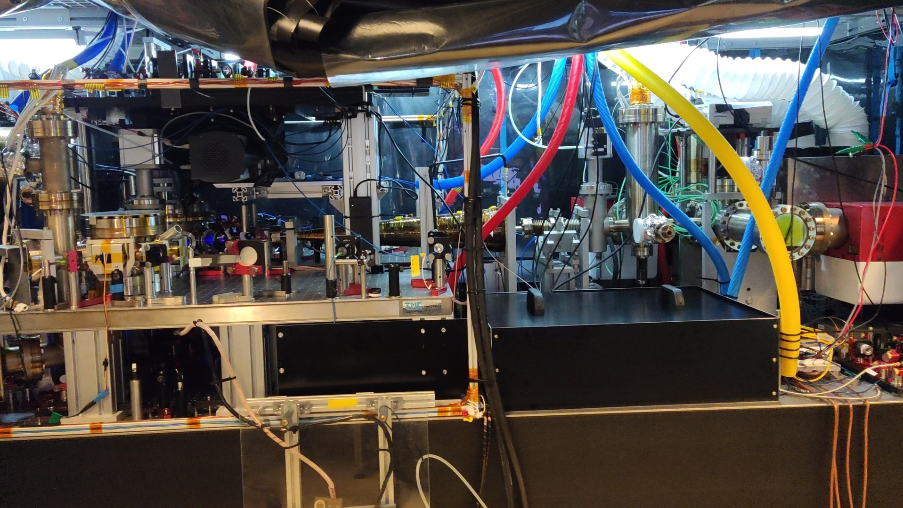
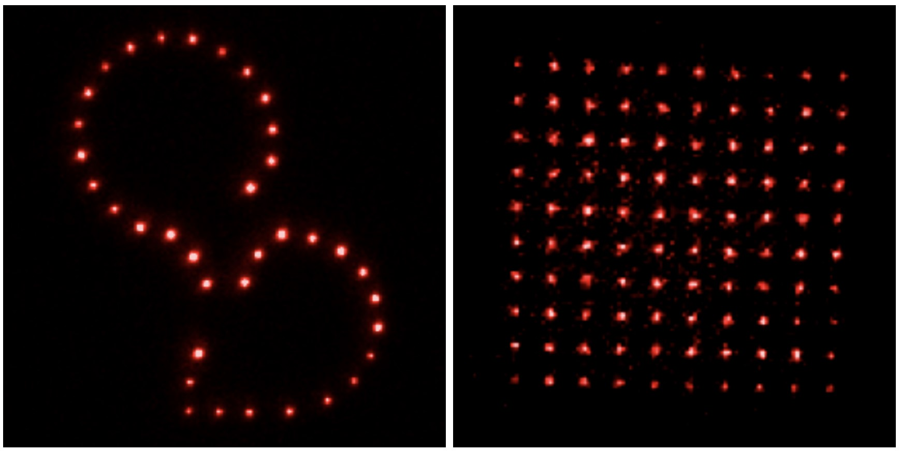

Auto Relocking ECDL using Redpitaya
=======================================

This project is for automatically relocking the External Cavity Diode Lasers (ECDLs) by 
wavemeter and/or cavity transmission using Redpitaya.

Overview
###########################

In this project I am presenting a web application dedicated for Redpitaya board for 
automatically and real-time relocking the external-cavity diode lasers (ECDLs) by 
cavity transmission and/or wavemeter signals. Here specifically this web application 
is used in Strontium (Sr) Optical Tweezer Machine for quantum computing and simulation. 
But it can be used in different cold atom applications, such as optical atomic clocks, 
transportable optical clocks, future satellite missions, space missions, and 
wherever you want to fully control the ECDLs. First of all I will explain a little bit 
about this machine then will explain how this web application is used to improved this machine.

Introduction
###########################

We are working on Sr Optical Tweezer Machine for quantum computing and simulation. In the Fig. 1 
you see a small view of this project, here Sr atoms are cooled down to level of micro kelvin or even 
less than that during laser cooling and magneto optical trapping (MOT). After cooling down, Sr atoms 
are trapped in optical tweezers, controlled by spatial light modulator (SLM) and acousto-optic deflector (AOD) 
to create different patterns of Sr atoms like Fig. 2.

.. 
  for new line write |
|

.. 
  for images with caption write figure
  without caption use image

  Fig. 1: A view of the Sr Optical Tweezer Machine.

  Fig. 2: Different patterns of Sr atoms, trapped in optical tweezers.
|
At the end after trapping Sr atoms in optical tweezers, we do the Rydberg spectroscopy by 
shining the Rydberg laser with 316.5 nm wavelength on the Sr atoms.

.. note::

    For more information about this project click on `Strontium Quantum Gas Group`_.
.. _Strontium Quantum Gas Group: http://www.strontiumbec.com/

Where we can Use this Web Application
###########################

* Manual Mode

  * Controlling Piezo Voltage of the Laser Driver
  * Controlling Current Voltage of the Laser Driver
  * Monitoring Wavemeter
  * Monitoring Cavity Transmission

* Automatic Mode

  * Relocking ECDLs only by Cavity Transmission
  * Relocking ECDLs only by Wavemeter
  * Relocking ECDLs by Cavity Transmission and Wavemeter
  * Relocking Transfer Cavity by DigiLock
  * Monitoring Wavemeter
  * Monitoring Cavity Transmission

.. note::

    If you want to use Wavemeter or DigiLock, Server should be running on the Wavemeter's PC

Server on the Wavemeter's PC
###########################
Server have to be run on the PC which the Wavemeter is connected on

.. note::

    For downloading the server application click on `Wavemeter API Server`_.

.. _Wavemeter API Server: https://github.com/mehrdadzarei/Wavemeter_API_Server_by_Python
    

