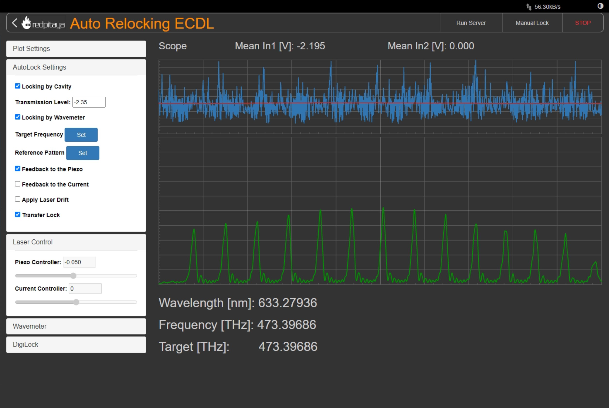

Auto Relocking ECDL using Redpitaya
========================================

This project is for automatically relocking the External Cavity Diode Lasers (ECDLs) by 
wavemeter and/or cavity transmission using Redpitaya.

Overview
****************************************

In this project I am presenting a web application dedicated for Redpitaya board for 
automatically and real-time relocking the external-cavity diode lasers (ECDLs) by 
cavity transmission and/or wavemeter signals. Here specifically this web application 
is used in Strontium (Sr) Optical Tweezer Machine for quantum computing and simulation. 
But it can be used in different cold atom applications, such as optical atomic clocks, 
transportable optical clocks, future satellite missions, space missions, and 
wherever you want to fully control the ECDLs. First of all I will explain a little bit 
about this machine then will explain how this web application is used to improved this machine.

Introduction
****************************************

We are working on Sr Optical Tweezer Machine for quantum computing and simulation. In the Fig. 1 
you see a small view of this project, here Sr atoms are cooled down to level of micro kelvin or even 
less than that during laser cooling and magneto optical trapping (MOT). After cooling down, Sr atoms 
are trapped in optical tweezers, controlled by spatial light modulator (SLM) and acousto-optic deflector (AOD) 
to create different patterns of Sr atoms like Fig. 2.

.. 
  for new line write |
  for images with caption write figure
  without caption use image

  
  Fig. 1: A view of the Sr Optical Tweezer Machine.

.. figure:: doc/img/fig2.jpg
  :width: 600
  :align: center
  :alt: Different patterns of Sr atoms, trapped in optical tweezers.
  
  Fig. 2: Different patterns of Sr atoms, trapped in optical tweezers.

At the end after trapping Sr atoms in optical tweezers, we do the Rydberg spectroscopy by 
shining the Rydberg laser with 316.5 nm wavelength on the Sr atoms.

.. note::

    For more information about this project click on `Strontium Quantum Gas Group`_.
.. _Strontium Quantum Gas Group: http://www.strontiumbec.com/

One of the big challenges in this project is that, Rydberg laser have to be locked on an exact 
frequency otherwise we are not able to do spectroscopy. Rydberg laser is locked to a cavity by 
the Pound–Drever–Hall (PDH) technique with FALC driver from Toptica company, this cavity is also 
locked to another stable laser (689 nm) with DigiLock driver from Toptica company which is called 
transfer cavity that transfer the stability of the 689 nm to the Rydberg laser. The problem is that 
these kind of lock are not stable for long time and laser would be out of lock because of electronic 
noises, mechanical noises, temperature drift, and …. Therefore I developed a web application for 
Redpitaya to be able manually and automatically control the piezo and current driver of the Rydberg laser. 
|
Schematic diagram of this project is shown in the Fig. 3. As you see we have two ECDLs (1070 nm and 1550 nm) 
controlled by laser driver from Toptica company for this project. Laser light from ECDLs would be amplify with 
fiber amplifiers to have more than of watts intensity to send them to sum frequency generation (SFG) to have 
red light (633 nm), and then light is going to second harmonic generation (SHG) to produce UV light (316.5 nm) 
for spectroscopy. Part of the red light after SFG is going to the wavemeter from HighFinnese company to measure 
the wavelength and to the transfer cavity to be locked by FALC driver. Transfer cavity is locked also to 689 nm 
laser which is very stable by DigiLock driver.

  
  Fig. 3: Schematic diagram of the project.

Relocking ECDL
****************************************

When the 633 nm laser is locked to the cavity (we are interested only on the mode TEM00) 
part of light is transmitted and is detected by a photo diode (PD) and camera for monitoring. 
PD signal is amplified and going to the input 1 of the Redpitaya to be processed and monitored. 
Redpitaya get information of the wavemeter and DigiLock from the server which is running on the PC 
that wavemeter is installed on. After processing information on the Redpitaya, an appropriate 
feedback is sent to the piezo and current controller of the 1550 nm from output 1 and 2 respectively.

.. note::

    There is a recorded video about this project with more details for running this project, 
    on YouTube which you can watch it `here`_.
.. _here: https://www.youtube.com/watch?v=h15hca77DVk

Installing RedPitaya
########################################

Redpitaya installed on an amplifier board which is providing power supply also for the Redpitaya and 
its connections is shown in the Fig. 4, PD signal is connected to the amplifier (we are amplifying the signal 25 times) 
then is going to the input 1 of the redpitaya. Output 1 is dedicated to send feedback to the piezo controller and 
output 2 is for current controller. Input 2 is just to monitoring any other signal if you need.

.. figure:: doc/img/fig4.jpg
  :width: 1000
  :align: center
  :alt: Redpitaya and its connections.
  
  Fig. 4: Redpitaya and its connections.

.. note::

    If you don’t need to amplify the signal, directly connect it to input 1.

.. warning::

    The signal should be in the range of Redpitaya (±1 V for LV and ±20 V for HV).

.. note::

    Output 1 and 2 for Redpitaya is limited on ±1 V, if you need more voltage to scan longer range of 
    frequency, use an amplifier and remember to set this range on the web application.

.. warning::

    Before applying voltage on the laser driver, becareful about the limitation of the laser driver to	avoid damaging the laser.

Laser driver is shown in the Fig. 5, as you see for applying feedback from Redpitaya to the piezo we used 
an analog interface, maybe in your case is different. As the feedback voltage is limited to 1 V, perhaps is 
not enough to scan whole range of frequency to find target frequency, therefore first find the target frequency 
manually by scan controller which is signed in the Fig. 5.

  
  Fig. 5: Laser driver and connected feedback signal from Redpitaya.

Run the Server on the Wavemeter’s PC
########################################

First of all run the server on the wavemeter’s PC, after running the server a message is written 
that server is running on a specific IP and Port number which have to be set in the batch file which 
run the server file. In the Fig. 6 a running server is shown. For connecting to the server from 
web application you have to set these IP and Port number which the server is listening on it on the web application.

  
  Fig. 6: Running server on the wavemeter's PC.

.. note::

    If you want to use Wavemeter or DigiLock, Server have to be running on the Wavemeter's PC.

.. note::

    For downloading the server application click on `Wavemeter API Server`_.
.. _Wavemeter API Server: https://github.com/mehrdadzarei/Wavemeter_API_Server_by_Python

Run the DigiLock software
########################################

DigiLock software for locking transfer cavity to the 689 nm laser should be running and the IP and 
Port number on the DigiLock software which is shown in the Fig. 7 should be set in the web application 
to let the Redpitaya to remotely control and lock the cavity.

  
  Fig. 7: DigiLock software and its IP and Port number.

Run the program on the web application
########################################

After setting initial parameters on the web application run the program to monitor cavity transmission and 
wavemeter's information. The algorithm operates in two modes: Either in manual mode or in automatic mode, 
when the laser is kept on the lock frequency. There are two different types of input signals which are selectable: 
cavity transmission and/or wavemeter signal. After processing the signals by the software, appropriate feedback is 
sent to the piezo and/or current controller of the laser driver. The relocking algorithms verify the lock by 
comparing the value of the cavity transmission signal and/or by comparing the frequency difference between preset 
frequency and frequency measured by the wavemeter. If one of those values is below a predefined threshold, 
the algorithm starts scanning the piezo to find the target frequency.

.. note::

    For setting transmission level in the situation which we want to lock the laser to the cavity, this value should be 
    set in the level that if transmission (Mean In1 in the Fig. 8) get lower than that, the algorithm start relocking 
    the laser. If the transmission voltage gap when laser is locked and out of lock is small, change the x range and y range 
    which is shown in the Fig. 8 to have a stable average signal (Mean In1).

  
  Fig. 8: Setting x and y range to stable transmission signal.

In the Fig. 9 there is a whole view of the web application developed for this project, in the Fig. 10, cavity transmission 
on the camera is shown and also locked cavity by DigiLock which all are automatically done by web application running on 
the Redpitaya.

.. note::

    To download the source code of web application click on `Auto Relocking Web Application`_.
.. _Auto Relocking Web Application: https://github.com/mehrdadzarei/AutoRelocking_ECDL_Laser_by_Redpitaya

.. note::

    To see a full instruction for developing this web application click on `Manual`_.
.. _Manual: https://github.com/mehrdadzarei/AutoRelocking_ECDL_Laser_by_Redpitaya/tree/master/doc

  
  Fig. 9: Web application running on the Redpitaya.

  
  Fig. 10: Locked Rydberg laser and cavity by web application.

Where is used this Web Application
****************************************

This application is used wherever you want to fully control the ECDLs. This web application works in two mode, 
manual and automatic mode. In each mode it is usable for:

#. Manual Mode

  * Controlling Piezo Voltage of the Laser Driver
  * Controlling Current Voltage of the Laser Driver
  * Monitoring Wavemeter
  * Monitoring Cavity Transmission

#. Automatic Mode

  * Relocking ECDLs only by Cavity Transmission
  * Relocking ECDLs only by Wavemeter
  * Relocking ECDLs by Cavity Transmission and Wavemeter
  * Relocking Transfer Cavity by DigiLock
  * Monitoring Wavemeter
  * Monitoring Cavity Transmission

.. note::

    If you want to use Wavemeter or DigiLock, Server should be running on the Wavemeter's PC

Caution
****************************************

Please before applying any voltage on your laser driver, first monitor them on the oscilloscope and limit 
the range based on the feature of your laser driver. **The author will not take any responsibility for damaged lasers**.

Acknowledgment
****************************************

This project 18SIB05 ROCIT has received funding from the EMPIR program co-financed by the Participating States 
and from the European Union’s Horizon 2020 research and innovation program. This project has received funding 
from the European Union’s Horizon 2020 Research and Innovation Program No 820404, (iqClock project). 
This project has received funding from the European Union’s Horizon 2020 research and innovation program under 
grant agreement No 860579 (MoSaiQC project). The project is partially performed at the National Laboratory 
FAMO (KL FAMO) in Toruń, Poland and were supported by a subsidy from the Polish Ministry of Science and Higher Education.
|
I am a PhD student at the Nicolaus Copernicus University under supervision Michal Zawada, but this project has been done 
at the University of Amsterdam in the Strontium quantum gas group under supervision Florian Schreck during my secondment. 

